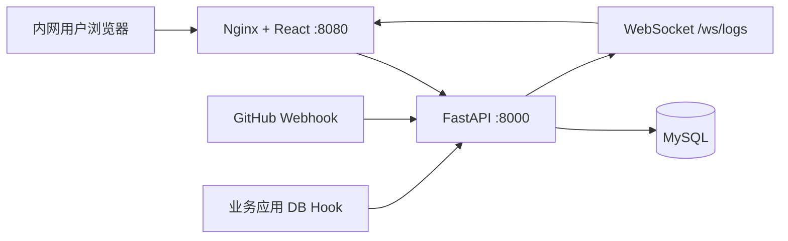

# QuickNavigation

内网测试运维快捷导航平台：维护项目常用连接、按项目/环境展示卡片、接收 GitHub / 数据库变更推送。

## 技术栈

| 层 | 技术 |
|----|------|
| 前端 | React 18 + Vite + TypeScript + Ant Design |
| 后端 | Python 3.12 + FastAPI + SQLAlchemy |
| 数据库 | MySQL 8.0 |
| 部署 | Docker Compose |

## 快速启动

```bash
docker compose up -d --build
```

启动后访问：

- 前端首页：http://localhost:8080
- 后端 API：http://localhost:8000
- API 文档：http://localhost:8000/docs
- MySQL：localhost:3309

## 功能说明

### 1. 连接管理

- 字段：名称、URL、描述、环境、项目、类型（normal/github/database）、是否共用
- 支持按名称、项目、环境检索
- 路径：首页「连接管理」或 `/connections`

### 2. 首页导航

- 顶部切换项目、环境
- 上方折叠区：共用连接（所有项目可见）
- 下方折叠区：当前项目+环境下的连接
- 卡片支持拖拽排序、点击跳转、编辑

### 3. 日志订阅

- GitHub：在「日志订阅」页为 github 类型连接创建订阅，配置 Webhook 指向：
  ```
  http://<你的内网IP>:8080/webhooks/github
  ```
- 数据库：创建订阅后复制 Webhook 地址，应用变更后 POST：
  ```json
  POST /webhooks/database?secret=<webhook_secret>
  {
    "operation": "UPDATE",
    "table": "users",
    "summary": "批量更新测试账号",
    "rows_affected": 3,
    "author": "zhangsan"
  }
  ```
- 首页右侧实时展示当前项目/环境下的活动日志（WebSocket 推送）

## 目录结构

```
QuickNavigation/
├── docker-compose.yml
├── backend/          # FastAPI 后端
│   ├── app/
│   │   ├── main.py
│   │   ├── models.py
│   │   ├── routers/
│   │   └── ...
│   └── Dockerfile
└── frontend/         # React 前端
    ├── src/
    ├── nginx.conf
    └── Dockerfile
```

## 环境变量

| 变量 | 说明 | 默认值 |
|------|------|--------|
| DATABASE_URL | MySQL 连接串 | docker-compose 内置 |
| GITHUB_WEBHOOK_SECRET | GitHub 签名密钥 | change-me-github-secret |
| CORS_ORIGINS | 跨域来源 | * |

生产部署前请修改 `docker-compose.yml` 中的数据库密码和 `GITHUB_WEBHOOK_SECRET`。

## 本地开发

**后端（建议使用虚拟环境，避免与全局 Python 包冲突）：**

```bash
cd backend
python -m venv .venv

# Windows
.venv\Scripts\activate

# macOS / Linux
# source .venv/bin/activate

pip install -r requirements.txt

# 先启动 MySQL（或 docker compose up mysql -d）
# 复制环境变量（可选，默认已指向 127.0.0.1:3309）
copy .env.example .env

uvicorn app.main:app --reload --port 8000
```

**前端：**

```bash
cd frontend
npm install
npm run dev
```

Vite 开发服务器已配置代理到 `localhost:8000`。

## 架构图


