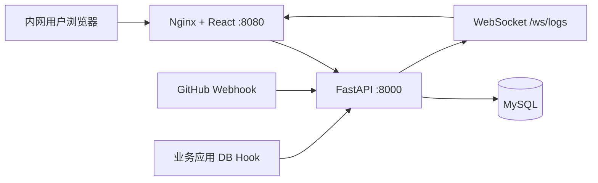

# QuickNavigation

内网测试运维快捷导航平台：维护项目常用连接、按项目/环境展示卡片、接收 GitHub / 数据库变更推送。

## 技术栈

| 层 | 技术 |
|----|------|
| 前端 | React 18 + Vite + TypeScript + Ant Design |
| 后端 | Python 3.12 + FastAPI + SQLAlchemy |
| 数据库 | MySQL 8.0 |
| 部署 | Docker Compose |

## 快速启动

```bash
docker compose up -d --build
```

启动后访问：

- 前端首页：http://localhost:8080
- 后端 API：http://localhost:8000
- API 文档：http://localhost:8000/docs
- MySQL：localhost:3309

## 功能说明

### 1. 连接管理

- 字段：名称、URL、描述、环境、项目、类型（normal/github/database）、是否共用
- 支持按名称、项目、环境检索
- 路径：首页「连接管理」或 `/connections`

### 2. 首页导航

- 顶部切换项目、环境
- 上方折叠区：共用连接（所有项目可见）
- 下方折叠区：当前项目+环境下的连接
- 卡片支持拖拽排序、点击跳转、编辑

### 3. 日志订阅

- GitHub / GitLab：在「日志订阅」页复制 Webhook 地址。须配置 `PUBLIC_WEBHOOK_BASE_URL` 为 **GitLab 服务器能访问** 的地址，例如：
  ```
  # docker compose 部署（推荐内网）
  PUBLIC_WEBHOOK_BASE_URL=http://192.168.6.127:8080
  # 本地开发，GitLab 与你在同一局域网
  PUBLIC_WEBHOOK_BASE_URL=http://192.168.6.127:8000
  ```
  GitLab 项目 → Settings → Webhooks → URL 填：`http://<上述基址>/webhooks/gitlab`
- 数据库：
  - **结构巡检（推荐）**：日志订阅页 → 数据库连接 →「结构巡检」，填写数据库 IP、端口、账号、密码并启用。系统每 5 分钟对比 `information_schema` 快照，自动检测建库/建表/改表/删表，写入活动日志（不监听数据变更）。
  - **Webhook 上报**：应用侧变更后 POST：
  ```json
  POST /webhooks/database?secret=<webhook_secret>
  {
    "operation": "UPDATE",
    "table": "users",
    "summary": "批量更新测试账号",
    "rows_affected": 3,
    "author": "zhangsan"
  }
  ```
- 首页右侧实时展示当前项目/环境下的活动日志（WebSocket 推送）

## 目录结构

```
QuickNavigation/
├── docker-compose.yml
├── backend/          # FastAPI 后端
│   ├── app/
│   │   ├── main.py
│   │   ├── models.py
│   │   ├── routers/
│   │   └── ...
│   └── Dockerfile
└── frontend/         # React 前端
    ├── src/
    ├── nginx.conf
    └── Dockerfile
```

## 环境变量

| 变量 | 说明 | 默认值 |
|------|------|--------|
| DATABASE_URL | MySQL 连接串 | docker-compose 内置 |
| GITHUB_WEBHOOK_SECRET | GitHub 签名密钥 | change-me-github-secret |
| GITLAB_WEBHOOK_SECRET | GitLab Secret token | change-me-gitlab-secret |
| PUBLIC_WEBHOOK_BASE_URL | Webhook 对外基址（GitLab 可访问） | 空 |
| SCHEMA_MONITOR_INTERVAL_SECONDS | 数据库结构巡检间隔（秒） | 300 |
| CORS_ORIGINS | 跨域来源 | * |

生产部署前请修改 `docker-compose.yml` 中的数据库密码和 `GITHUB_WEBHOOK_SECRET`。

## 离线 / 内网部署（镜像本地化）

若目标服务器无法访问 Docker Hub / 外网，可在**有网络的机器**上先打包镜像，再拷贝到服务器导入。

### 涉及的外部镜像

| 来源 | 镜像 |
|------|------|
| Docker Hub | `mysql:8.0`、`nginx:latest`、`python:3.12-slim`、`node:20-alpine`、`nginx:1.27-alpine` |
| Docker Hub | `omnidbteam/omnidb:latest`、`niruix/sshwifty:latest`、`redis/redisinsight:latest` |
| Redpanda 仓库 | `docker.redpanda.com/redpandadata/console:v2.8.0` |
| 本地构建 | `backend`、`frontend`、`omnidb`、`sshwifty`、`redpanda-console`、`redisinsight` 等 |

### 步骤一：有网机器导出

**Windows（开发机）：**

```powershell
cd E:\workspace\QuickNavigation
powershell -ExecutionPolicy Bypass -File scripts/docker/export-offline.ps1
```

**Linux：**

```bash
cd /path/to/QuickNavigation
bash scripts/docker/export-offline.sh
```

完成后会生成：

- `offline/docker-images/quicknav-images.tar` — 全部镜像包
- `offline/docker-images/images.txt` — 镜像清单

### 步骤二：拷贝到目标服务器

将以下内容传到服务器（U 盘 / scp 均可）：

1. 整个项目目录（或至少 `docker-compose.yml`、`docker-compose.offline.yml`、`docker/`、`backend/`、`frontend/`、`scripts/`）
2. `offline/docker-images/quicknav-images.tar`

### 步骤三：服务器导入并启动

```bash
cd /path/to/QuickNavigation
bash scripts/docker/import-offline.sh
```

或 Windows 服务器：

```powershell
powershell -ExecutionPolicy Bypass -File scripts/docker/import-offline.ps1
```

`docker-compose.offline.yml` 会设置 `pull_policy: never`，**只使用本地镜像，不再联网拉取**。

### 仅手动操作（不用脚本）

```bash
# 有网机器
export COMPOSE_PROJECT_NAME=quicknav
docker compose pull mysql sshwifty-app redisinsight-app
docker compose build
docker save -o quicknav-images.tar $(docker compose config --images | sort -u)

# 目标服务器
docker load -i quicknav-images.tar
docker compose -f docker-compose.yml -f docker-compose.offline.yml up -d --no-build
```

### 更新镜像后重新导出

代码或 Dockerfile 有变更时，在有网机器重新执行 `export-offline`，再覆盖服务器上的 tar 并 `docker load` 后重启即可。

### 导出时拉取失败（代理 / 10808 端口）

若出现 `connecting to 127.0.0.1:10808`、`EOF` 等错误，通常是 **Docker 走了本机代理但代理不稳定**：

1. 打开 **Docker Desktop → Settings → Resources → Proxies**
2. 关闭 **Manual proxy configuration**（或修正代理地址）
3. 重启 Clash / V2Ray 等代理软件（`10808` 端口占用也会导致失败）
4. 单独测试：`docker pull nginx:latest`
5. 成功后再执行 `export-offline.ps1`

脚本已自动清除当前终端里的 `HTTP_PROXY` 等变量，但 **Docker 守护进程自己的代理配置** 仍需在 Docker Desktop 里关闭或修正。

### 使用本地代理 + 国内镜像（推荐）

国内拉 Docker Hub 不稳定时，可以 **代理 + 镜像** 组合使用：

**1. Docker Desktop 配置（二选一或同时开）**

- **代理**：Settings → Resources → Proxies → Manual proxy  
  `http://127.0.0.1:10808`（Clash 端口按你实际改，常见还有 `7890`）
- **镜像加速**：Settings → Docker Engine，参考 `scripts/docker/daemon.json.example`：

```json
{
  "registry-mirrors": ["https://docker.1ms.run", "https://docker.m.daocloud.io"]
}
```

**2. 导出脚本环境变量**

```powershell
# 走本地代理（Clash / V2Ray）
$env:USE_PROXY = "1"
$env:HTTP_PROXY = "http://127.0.0.1:10808"   # 或 7890

# 国内镜像（Docker Hub 类镜像会自动 fallback）
$env:DOCKER_MIRROR = "docker.1ms.run"

# x86 离线包
powershell -ExecutionPolicy Bypass -File scripts/docker/export-offline.ps1

# ARM64 服务器（had-13 等 aarch64）
powershell -ExecutionPolicy Bypass -File scripts/docker/export-arm64.ps1
```

**3. 各镜像来源说明**

| 镜像 | 建议方式 |
|------|----------|
| mysql / nginx / python / node | 国内镜像 `docker.1ms.run/library/...` |
| omnidb / sshwifty / redisinsight | 先镜像，失败再代理 |
| redpanda console | 仅 redpanda 官方仓库，**通常需要代理** |

**4. 手动测试单镜像**

```powershell
docker pull docker.1ms.run/library/mysql:8.0
docker tag docker.1ms.run/library/mysql:8.0 mysql:8.0

docker pull --platform linux/arm64 docker.1ms.run/library/mysql:8.0
docker tag docker.1ms.run/library/mysql:8.0 mysql:8.0
```

**5. 代理端口冲突**

若报 `127.0.0.1:10808 ... Only one usage of each socket address`：重启 Clash，或改用混合端口 `7890`，并同步改 Docker Desktop 代理地址。

## 本地开发

**后端（建议使用虚拟环境，避免与全局 Python 包冲突）：**

```bash
cd backend
python -m venv .venv

# Windows
.venv\Scripts\activate

# macOS / Linux
# source .venv/bin/activate

pip install -r requirements.txt

# 先启动 MySQL（或 docker compose up mysql -d）
# 复制环境变量（可选，默认已指向 127.0.0.1:3309）
copy .env.example .env

uvicorn app.main:app --reload --host 0.0.0.0 --port 8000
```

在 `backend/.env` 中设置（把 IP 换成你本机局域网地址）：

```env
PUBLIC_WEBHOOK_BASE_URL=http://192.168.6.127:8000
```

**前端：**

```bash
cd frontend
npm install
npm run dev
```

Vite 已开启 `--host`，局域网可通过 `http://192.168.6.127:5173` 访问页面；**Webhook 仍应指向后端 8000 或 Docker 8080**，不要填 5173（除非仅作临时联调且 GitLab 能访问该地址）。

### 网络说明

| 场景 | 浏览器访问 | GitLab Webhook 填 |
|------|-----------|------------------|
| Docker 全栈 | `http://192.168.6.127:8080` | `http://192.168.6.127:8080/webhooks/gitlab` |
| 本地开发 | `http://192.168.6.127:5173` | `http://192.168.6.127:8000/webhooks/gitlab` |
| GitLab.com 公网 | 需公网域名或内网穿透 | `https://你的域名/webhooks/gitlab` |

若 `192.168.6.127:5173` 仍打不开，检查：① 前后端是否已启动；② Windows 防火墙是否放行 5173/8000/8080；③ 是否用了 `--host` / `0.0.0.0` 监听。

## 架构图


